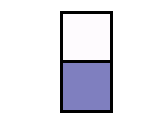
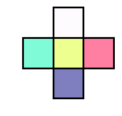
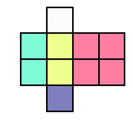
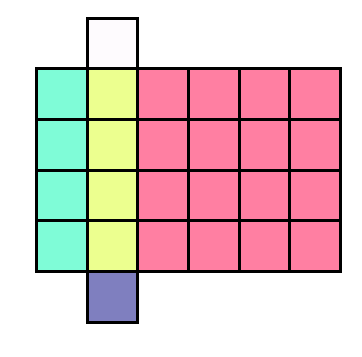

Math teaching tool for creating [quadratic tile patterns](https://tasks.illustrativemathematics.org/content-standards/tasks/2121).

```python
import pattern

#: create patterns with text-based building blocks: (., |, -, /, \, O)
pat1 = """
 .
||O
 .
"""

pattern.pattern_to_array(pat1, dim=4)
# array([[0, 1, 0, 0, 0, 0],
#        [2, 3, 4, 4, 4, 4],
#        [2, 3, 4, 4, 4, 4],
#        [2, 3, 4, 4, 4, 4],
#        [2, 3, 4, 4, 4, 4],
#        [0, 5, 0, 0, 0, 0]])

for i in range(4):
    pattern.plot(pat1, dim=i, alpha=0.5, *savepath=f"pat1_fig{i}.jpg")
```
  
_Figure 0_

  
_Figure 1_

  
_Figure 2_

  
_Figure 3_

```python
#: customize dimensions for target values with `val_to_dim`
pat2 = """
--. .-
  | |
  | |
  . .
   |
  . .
"""

vtd = {
    5: lambda d: d * 3, 
    12: lambda d: 3 - d
}

pattern.pattern_to_array(pat2, dim=2, val_to_dim=vtd)
# array([[ 1,  1,  2,  2,  3,  0,  4,  5,  5,  5,  5,  5,  5],
#        [ 0,  0,  0,  0,  6,  0,  7,  0,  0,  0,  0,  0,  0],
#        [ 0,  0,  0,  0,  6,  0,  7,  0,  0,  0,  0,  0,  0],
#        [ 0,  0,  0,  0,  8,  0,  9,  0,  0,  0,  0,  0,  0],
#        [ 0,  0,  0,  0,  8,  0,  9,  0,  0,  0,  0,  0,  0],
#        [ 0,  0,  0,  0, 10,  0, 11,  0,  0,  0,  0,  0,  0],
#        [ 0,  0,  0,  0,  0, 12,  0,  0,  0,  0,  0,  0,  0],
#        [ 0,  0,  0,  0, 13,  0, 14,  0,  0,  0,  0,  0,  0]])
```
