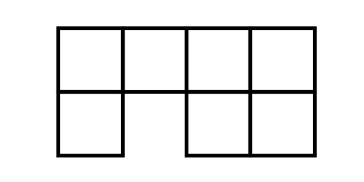
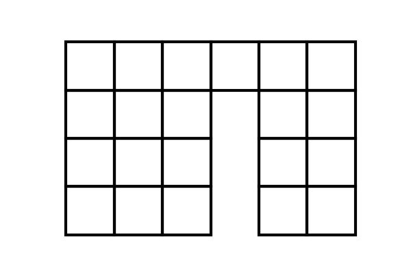
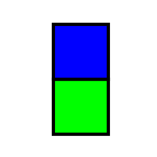
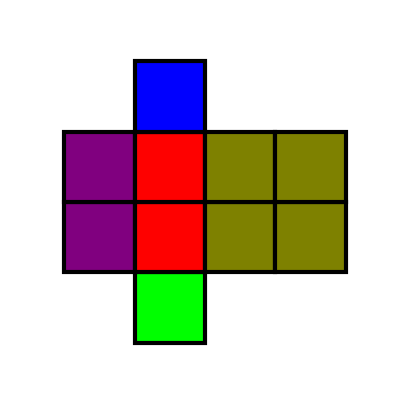
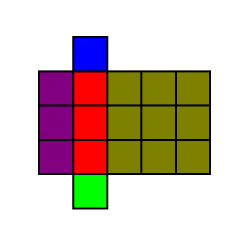

# Tile Pattern
Math teaching tool for generating [quadratic tile patterns][] images from a pattern template. To be used alongside [algebra tiles][] for students to make predictions and write algebraic equations.

[quadratic tile patterns]: https://tasks.illustrativemathematics.org/content-standards/tasks/2121
[algebra tiles]: https://en.wikipedia.org/wiki/Algebra_tile 

<!-- 

 -->

Accepted Tile Placeholders:
- Unit(.)
- Linear(-, |, /, \\) _[Note: diagonals being worked on]_
- Quadratic(O)

_[Currently can only align tiles along matching side lengths.]_

## CLI Usage
```
>>> python -m pattern -h
usage: pattern [-h] [-bw] [-cm COLORMAP] [-o [DIR]] [-p PREFIX] [-v]
               infile dim [dim ...]

Tile pattern parser from txt to png

positional arguments:
  infile                filepath with pattern to parse
  dim                   dimensions to form pattern

optional arguments:
  -h, --help            show this help message and exit
  -a, --alpha           transparency of the colors used in png output; 
                        set to 0 for b/w png
  -cm COLORMAP, --colormap COLORMAP
                        colormap used to differentiate tile parts; see
                        https://matplotlib.org/tutorials/colors/colormaps.html
  -o [DIR], --outdir [DIR]
                        destination file for png output; if omitted, png is
                        popup; if not arg, save png to cwd
  -p PREFIX, --prefix PREFIX
                        prefix used for png output; use alongside outdir
  -v, --verbose         print to stdout the array used for png creation

>>> python -m pattern pat.txt 1 3 --alpha 0 --verbose --outdir
Pattern:
-...
O ||
Dim: 1
[[1 2 3 4]
 [5 0 6 7]]
Dim: 3
[[1 1 1 2 3 4]
 [5 5 5 0 6 7]
 [5 5 5 0 6 7]
 [5 5 5 0 6 7]]

>>> ls *.png
pat_dim1.png    pat_dim3.png
```



## Package Usage
```python
import pattern

#: create patterns with text-based building blocks: (., |, -, /, \, O)
pat1 = """
 .
||O
 .
"""

for i in range(4):
    pattern.plot_pattern(pat1, dim=i, colormap='brg', savepath=f"pat1_dim{i}.jpg")
```
  
_Figure 0_

  
_Figure 1_

  
_Figure 2_

  
_Figure 3_

```python
#: customize dimensions for target values with `val_to_dim`
pat2 = """
--. .-
  | |
  | |
  . .
   |
  . .
"""

vtd = {
    5: lambda d: d * 3, 
    12: lambda d: 3 - d
}

pattern.pattern_to_array(pat2, dim=2, val_to_dim=vtd)
# array([[ 1,  1,  2,  2,  3,  0,  4,  5,  5,  5,  5,  5,  5],
#        [ 0,  0,  0,  0,  6,  0,  7,  0,  0,  0,  0,  0,  0],
#        [ 0,  0,  0,  0,  6,  0,  7,  0,  0,  0,  0,  0,  0],
#        [ 0,  0,  0,  0,  8,  0,  9,  0,  0,  0,  0,  0,  0],
#        [ 0,  0,  0,  0,  8,  0,  9,  0,  0,  0,  0,  0,  0],
#        [ 0,  0,  0,  0, 10,  0, 11,  0,  0,  0,  0,  0,  0],
#        [ 0,  0,  0,  0,  0, 12,  0,  0,  0,  0,  0,  0,  0],
#        [ 0,  0,  0,  0, 13,  0, 14,  0,  0,  0,  0,  0,  0]])
```
